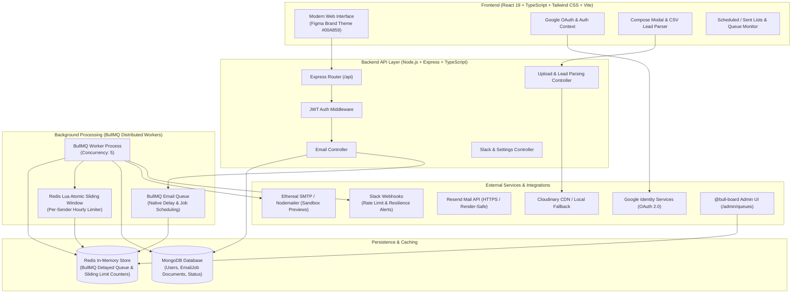
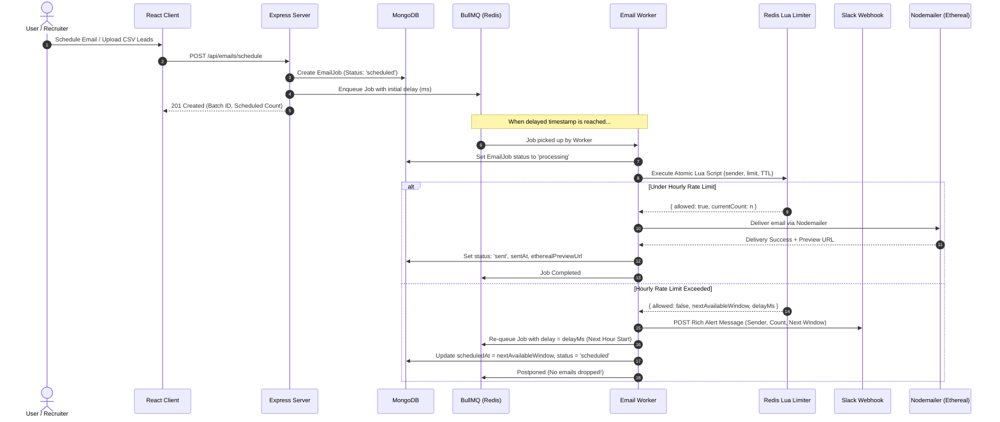

# Outbox Labs — Full-Stack Email Job Scheduler

A production-grade, distributed **Email Job Scheduler** built for the Outbox Labs SWE Intern Assessment.


---

## 🌐 Live Deployments & Assessment Links

| Service | URL | Description |
| :--- | :--- | :--- |
| **Frontend (Vercel)** | [https://outbox-assessment-lime.vercel.app/](https://outbox-assessment-lime.vercel.app/) | Production React 19 Client with Tailwind & Framer Motion |
| **Backend API (Render)** | [https://outbox-assessment-g02v.onrender.com](https://outbox-assessment-g02v.onrender.com) | Express API, Resend Dispatch, & Health Check |
| **CRM / Queue Dashboard** | [https://outbox-assessment-g02v.onrender.com/admin/queues](https://outbox-assessment-g02v.onrender.com/admin/queues) | Live BullMQ / Redis Queue Activity Monitor |
| **Repository Collaborators** | `mitrajit`, `Yadav036` | Invited repository evaluators |

---

## 🏗️ System Architecture

### 1. High-Level Architecture Diagram



---

### 2. Rate-Limiting & Rescheduling Sequence Flow



---

## ✅ PRD Requirements Implemented

| Requirement | Implementation Details | Status |
|---|---|:---:|
| **Timestamp Scheduling** | Delayed job execution via BullMQ without relying on crons | ✅ Complete |
| **No Cron Jobs** | BullMQ's native `delay` timestamp queue mechanism | ✅ Complete |
| **Batch Staggering** | Configurable delay (seconds) between sequential recipient sends | ✅ Complete |
| **Hourly Rate Limiting** | Multi-process atomic Redis Lua sliding window per sender | ✅ Complete |
| **Postpone When Throttled** | Automatically rescheduled to start of next hour; never dropped | ✅ Complete |
| **Slack Webhook Alerts** | Rich block alerts sent to configured Slack channel upon throttling | ✅ Complete |
| **Nodemailer Delivery** | Nodemailer with automatic Ethereal SMTP test account creation | ✅ Complete |
| **Ethereal Preview URLs** | Generated preview URL stored on every sent email record | ✅ Complete |
| **Bulk Lead Parsing** | Upload `.csv` or `.txt` lead lists; parses and staggers batch jobs | ✅ Complete |
| **Attachments (Cloudinary)** | Cloudinary CDN upload with automatic local storage fallback | ✅ Complete |
| **Google OAuth Sign-In** | Google Identity Services popup + ID token verification | ✅ Complete |
| **BullMQ Admin Board** | Real-time queue visualizer via `@bull-board` at `/admin/queues` | ✅ Complete |
| **Email Cancellation** | Removes job from BullMQ queue and marks cancelled in MongoDB | ✅ Complete |
| **Figma-Accurate UI** | Clean Emerald `#00A859` design system, Oliver Brown profile | ✅ Complete |

---

## 🚀 Quick Start (Local Setup)

### Prerequisites
- **Node.js**: v18.0 or newer
- **MongoDB**: Running locally on `mongodb://127.0.0.1:27017` (or MongoDB Atlas URI)
- **Redis**: Running locally on `redis://127.0.0.1:6379` (or Upstash / Redis Cloud)

### 1. Clone & Install Dependencies
```bash
# Clone the repository
git clone https://github.com/raeesa2627/outbox_assessment.git
cd outbox_assessment

# Install root, server, and client dependencies
npm run install:all
```

### 2. Configure Environment Variables
Create a `.env` file in the root directory:
```env
PORT=5000
NODE_ENV=development
MONGODB_URI=mongodb://127.0.0.1:27017/outbox_scheduler
REDIS_URL=redis://127.0.0.1:6379
JWT_SECRET=outbox-secret-key-super-secure-production-jwt-token-2026
GOOGLE_CLIENT_ID=your-google-client-id.apps.googleusercontent.com
MAX_EMAILS_PER_HOUR=10
DEFAULT_DELAY_BETWEEN_EMAILS_MS=2000
WORKER_CONCURRENCY=5
SLACK_WEBHOOK_URL=https://hooks.slack.com/services/...
CLOUDINARY_CLOUD_NAME=
CLOUDINARY_API_KEY=
CLOUDINARY_API_SECRET=
```

Create a `client/.env` file:
```env
VITE_GOOGLE_CLIENT_ID=your-google-client-id.apps.googleusercontent.com
VITE_API_BASE_URL=http://localhost:5000/api
```

### 3. Start Development Servers
```bash
# Runs both backend and frontend concurrently
npm run dev
```

- Frontend App: **http://localhost:5173**
- Backend API: **http://localhost:5000/api**
- BullMQ Live Dashboard: **http://localhost:5000/admin/queues**

---

## 🔌 API Reference

### Authentication
- `POST /api/auth/google` — Authenticate using Google OAuth ID token.
- `POST /api/auth/demo-login` — 1-click demo login (Oliver Brown).
- `GET /api/auth/me` — Retrieve authenticated user profile.

### Email Scheduling & Management
- `POST /api/emails/schedule` — Enqueue single email or batch list with custom delays & rate limits.
- `GET /api/emails/scheduled` — Retrieve scheduled/pending jobs (supports `?search=` and pagination).
- `GET /api/emails/sent` — Retrieve sent/failed email history with Ethereal preview links.
- `GET /api/emails/stats` — Dashboard counters (scheduled, sent, failed, live BullMQ metrics).
- `DELETE /api/emails/:id` — Cancel an email and remove it from the BullMQ queue.

### Uploads & Integrations
- `POST /api/upload/attachment` — Upload images or attachments to Cloudinary (or local fallback).
- `POST /api/upload/leads` — Parse CSV/TXT file and extract valid recipient email addresses.
- `POST /api/settings` — Update custom Slack Webhook URL.
- `POST /api/settings/test-slack` — Trigger a test rate-limit notification to Slack.

---

## ⚙️ Concurrency & Multi-Process Safety

### Atomic Lua Sliding Window Rate Limiter
To prevent race conditions across multiple distributed worker threads, rate limit evaluation is executed atomically inside Redis using the following Lua script:

```lua
local key = KEYS[1]
local limit = tonumber(ARGV[1])
local ttl = tonumber(ARGV[2])

local current = redis.call('get', key)
if current and tonumber(current) >= limit then
  return { 0, tonumber(current) }
else
  local newval = redis.call('incr', key)
  if newval == 1 then
    redis.call('expire', key, ttl)
  end
  return { 1, newval }
end
```

If the hourly threshold is reached:
1. The script returns `{ 0, currentCount }`.
2. The worker computes the exact milliseconds remaining until the start of the next hour window (`nextAvailableWindow`).
3. The job is postponed by calling `addEmailToQueue(data, delayMs)`.
4. A rich Slack webhook alert is dispatched.
5. Zero emails are lost or dropped.

---

## 🗂️ Project Directory Structure

```
outbox_assignment/
├── .env.example              # Documented server environment template
├── .gitignore                # Production ignore rules
├── README.md                 # Full project architecture & documentation
├── package.json              # Root workspace runner (concurrently)
├── server/
│   ├── src/
│   │   ├── config/           # Database, Redis, and env configuration
│   │   ├── controllers/      # Auth, Email, Upload, Settings controllers
│   │   ├── middleware/       # JWT auth verification middleware
│   │   ├── models/           # Mongoose schemas (User, EmailJob)
│   │   ├── queues/           # BullMQ Queue definitions & helpers
│   │   ├── routes/           # Express route definitions
│   │   ├── services/         # Mailer (Ethereal), Lua RateLimiter, Slack
│   │   ├── workers/          # BullMQ background worker loop
│   │   └── index.ts          # Express server entry point + @bull-board
│   ├── package.json
│   └── tsconfig.json
└── client/
    ├── src/
    │   ├── components/       # LoginView, Sidebar, Header, ComposeModal, etc.
    │   ├── context/          # React AuthContext (Google OAuth & Demo)
    │   ├── services/         # Axios API service client
    │   ├── types/            # TypeScript interfaces
    │   ├── App.tsx           # Main application view container
    │   └── main.tsx          # React 19 root + GoogleOAuthProvider
    ├── index.html            # HTML entry point with Google Fonts
    ├── package.json
    ├── vite.config.ts        # Vite configuration
    └── tailwind.config.js    # Custom brand color definitions (#00A859)
```

---

## 👨‍💻 Author & Submission

- **Candidate**: Raeesa
- **Position**: Software Development Engineer Intern
- **Company**: Outbox Labs
- **Repository**: [raeesa2627/outbox_assessment](https://github.com/raeesa2627/outbox_assessment.git)
